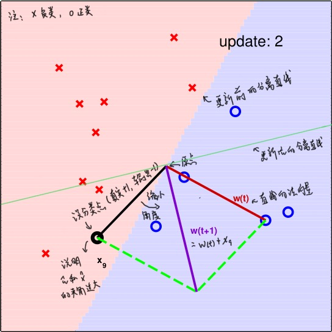
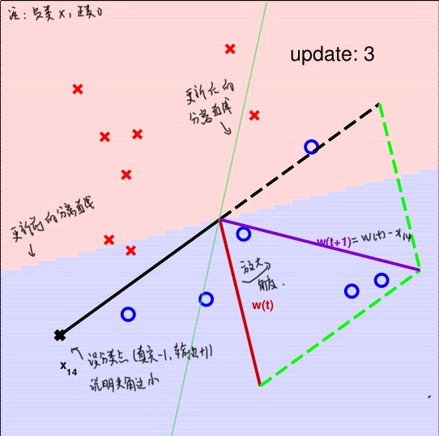

### 感知机原理

感知机是二分类的线性分类模型，本质上想找到一条直线或者分离超平面对数据进行线性划分
- 适用于线性可分的数据集，否则感知机不会收敛

假设有一个数据集$D = {(x_1, y_1), (x_2, y_2), ..., (x_N, y_N)}$，其中$x_i \in R^n$，即$x_i = (x_i^{(1)}, x_i^{(2)}, ...x_i^{(n)})$
- 模型的输入为实例的特征向量$x_i$，输出为实例的类别，取值为+1（正例）或者-1（负例）
- 我们希望找到一个分离超平面$w^Tx + b = 0，其中w \in R^n$，使得有满足$w^Tx + b > 0$的实例所对应的类别为正例。而使得满足$w^Tx + b < 0$的实例所对应的类别为负例。

于是我们可以构建出感知机模型为：$f(x) = sign(w^Tx + b)$

### 损失函数

定义损失函数一个很自然的想法是建立在误分类点的个数上，但是使用误分类点的个数来构造损失函数并不容易优化
- 因此使用**误分类点到分离超平面的总距离**来构造损失函数

记M为误分类点的集合，误分类点到分离超平面的总距离为：
$$L(w, b) = \sum_{x_i \in M}\frac{| w^Tx_i + b |}{\parallel w \parallel}$$

不考虑$\frac{1}{\parallel w \parallel}$（因为上式中，分子和分母有固定倍数的关系），并且去掉绝对值，就可以得到感知机的损失函数为：
$$L(w, b) = \sum_{x_i \in M} -y_i (w^Tx_i + b)$$
此时对于误分类点，$-y_i (w^Tx_i + b) > 0$成立

### 优化方法

此时感知机算法就转变为，求解参数$w, b$，使得损失函数极小化，即
$$\underset {w, b}{\arg \min L(w, b)} = \underset {w, b}{\arg \min} \sum_{x_i \in M} -y_i (w^Tx_i + b)$$

因为只有对误分类点才会对损失函数进行优化，因此感知机的优化采用随机梯度下降法（SGD），而非使用所有样本的批量随机梯度下降法（BGD）

损失函数$L(w, b)$的梯度为：
$$\frac{\partial L(w, b)}{\partial w} = -\sum_{x_i \in M} y_i x_i$$
$$\frac{\partial L(w, b)}{\partial b} = -\sum_{x_i \in M} y_i$$

对于SGD，选取一个误分类点进行更新，即有：
$$w_{t+1} = w_t + \alpha y_ix_i$$
$$b_{t+1} = b_t + \alpha y_i$$

### 感知机的原始算法

训练集包括N个样例，样本中包含n个特征，标记为二分类取值为-1或者+1
- 输入的样例：${(x_1, y_1), (x_2, y_2), ..., (x_N, y_N)}$，学习率：$\alpha$
- 输出分离超平面的系数w, b

算法执行步骤如下：
1. 初始化w, b以及学习率$\alpha$
2. 在训练集选取数据$(x_i, y_i)$
3. 如果满足$-y_i(sign(w^Tx_i + b)) > 0$，则
$$w_{t+1} = w_t + \alpha y_i x_i$$
$$b_{t+1} = b_t + \alpha y_i$$
4. 转至2，直到训练集中没有误分类点

### 感知机的对偶算法

对偶形式的基本想法是，将$w$和$b$表示为实例$x_i$和标记$y_i$的线性组合的形式，通过求解它的系数来求解$w$和$b$

假设初始值$w_0$和$b_0$都为0，因此$w$和$b$可以表示成$x_iy_i$和$y_i$的增量形式，即原始形式可以化成：
$$w_{t+1} = \sum_{i=1}^{N}\beta_i y_i x_i$$
$$b_{t+1} = \sum_{i=1}^N \beta_i y_i$$
其中，$\beta_i = n_i \alpha$，$n_i$表示第$i$个实例$x_i$更新的次数 
此时，模型转变为
$$f(x) = sign(\sum_{j=1}^N \beta_j x_j y_j x + b)$$

训练集包括N个样例，样本中包含n个特征，标记为二分类取值为-1或者+1
- 输入的样例：${(x_1, y_1), (x_2, y_2), ..., (x_N, y_N)}$，学习率：$\alpha$
- 输出分离超平面的系数$\beta$, b

算法执行步骤如下：
1. 初始化$\beta$, b以及学习率$\alpha$
2. 在训练集选取数据$(x_i, y_i)$
3. 如果满足$y_i(sign(\sum_{j=1}^N \beta_j y_j x_j x_i + b)) <= 0$，则
$$\beta_j(t+1) = \beta_j(t) + \alpha $$
$$b_{t+1} = b_t + \alpha y_i$$
4. 转至2，直到训练集中没有误分类点

其中，训练实例可以通过计算Gram矩阵（即$x_i$和$x_j$的内积组成的矩阵）的形式来存储

### 从图形中理解感知机的原始算法

为了方便说明，记$\hat w = (w, b)$，$\hat x = (x, 1)$，则感知机模型可以变为：
$$f(x) = sign(\hat w^T \hat x)$$

之前我们说明了，只有误分类点才会对$\hat w$进行更新。因此，考虑以下两种情况：
1. 真实类别为y=+1, 但是模型的输出为-1
    - 考虑到$\hat w^T \hat x = |\hat w||\hat x|cos\theta$
    - 对于真实类别，我们希望说明$\hat w^T \hat x > 0$，即$\hat w$和$\hat x$的夹角越小越好，而模型的输出有$\hat w^T \hat x < 0$，则说明$\hat w$和$\hat x$的夹角过大
    - 因此，我们可以通过减少$\hat w$和$\hat x$的夹角来达到目的，即有$\hat w(t+1) = \hat w(t) + \hat x(t)$（对应着$w_{t+1} = w_t + \alpha y_i x_i$，且$\alpha = 1$的情况）
    - $y_i \hat w_{t+1}^T \hat x_i = y_i \hat w_t^T \hat x_i + y_i \parallel \hat x_i \parallel \geq y_i \hat w_t^T \hat x_i$

2. 真实类别为y=-1, 但是模型的输出为+1
    - 考虑到$\hat w^T \hat x = |\hat w||\hat x|cos\theta$
    - 对于真实类别，我们希望说明$\hat w^T \hat x < 0$，即$\hat w$和$\hat x$的夹角越大越好，而模型的输出有$\hat w^T \hat x > 0$，则说明$\hat w$和$\hat x$的夹角过小
    - 因此，我们可以通过增大$\hat w$和$\hat x$的夹角来达到目的，即有$\hat w(t+1) = \hat w(t) - \hat x(t)$（对应着$w_{t+1} = w_t - \alpha y_i x_i$，且$\alpha$ = 1的情况）
    - $y_i \hat w_{t+1}^T \hat x_i = y_i \hat w_t^T \hat x_i - y_i \parallel \hat x_i \parallel = y_i \hat w_t^T \hat x_i + \parallel \hat x_i \parallel \geq y_i \hat w_t^T \hat x_i$

其实，无论对于误分类的情况1还是情况2，总有$y_i \hat w_{t+1}^T \hat x_i = \geq y_i \hat w_t^T \hat x_i$，因为$y_i \hat w_t^T \hat x_i$的符号代表是否分类正确，大小代表分类超平面是否将其“分得很开”，上面的不等式说明了，对于某个误分类点来说，更新后要比更新前要好，算法PLA对该误分类点“学习”了。

### 感知机算法(PLA)的收敛性

对于线性可分的数据集，总能找到一个或者多个分类超平面能将该数据集划分，这表明了PLA的收敛性。
- 这部分主要参考林轩田的《机器学习基石》，个人觉得讲得要比李航的《统计学习方法》要清晰，虽然证明本质上是一样的

说明两个向量的相似性有很多方法，其中计算两个向量的内积是一种方法。当内积越大，表明两个向量越相似。当然，这需要考虑向量的长度，当模长越大时，向量的内积也会越来越大。
- 符号说明：$w_f$代表真实的w，$w_t$代表我们找到的w，这里为了符号简洁些，不记成$\hat w$，但是含义一样，即$w_f$和$w_t$里面包含$b$，记学习率$\alpha = 1$

1. 先讨论$w_f$和$w_t$的内积，$w_0$为0向量
  $$
  \begin{equation}
  \begin{split}
  w_f^T w_t & = w_f^T(w_{t-1} + y_ix_i) \\
  & = w_f^T w_{t-1} + y_i w_f^T x_i \\
  & \geq w_f w_{t-1} + \underset {i} {min} (y_i w_f^T x_i) \\
  & \geq w_f w_0 + t \underset {i} {min} (y_i w_f^T x_i) \\
  & = t \underset {i} {min} (y_i w_f^T x_i)
  \end{split}
  \end{equation}
  $$

2. 讨论$w_f$和$w_t$的模长，由于只有误分类点才更新，所以有$y_i w_{t}^T x_i \leq 0$
  $$
  \begin{equation}
  \begin{split}
  \parallel w_t \parallel^2 & = \parallel w_{t-1} + y_ix_i \parallel^2 \\
  &= \parallel w_{t-1} \parallel^2 + 2y_i w_{t_1}^T x_i + \parallel y_ix_i \parallel^2 \\
  & \leq \parallel w_{t-1} \parallel^2 + \parallel x_i \parallel^2 \\
  & \leq \parallel w_{t-1} \parallel^2 + \underset {i} {max} \parallel x_i \parallel^2 \\
  & \leq \parallel w_{0} \parallel^2 + t \underset {i} {max} \parallel x_i \parallel^2 \\ 
  & = t \underset {i} {max} \parallel x_i \parallel^2
  \end{split}
  \end{equation}
  $$

3. 讨论$w_f$和$w_t$的角度
  $$
  \begin{equation}
  \begin{split}
  1 \geq cos \theta = \frac{w_f^T w_t}{\parallel w_f \parallel \parallel w_t \parallel} & 
  \geq \frac{t \underset {i} {min} (y_i w_f^T x_i)}{\parallel w_f \parallel \sqrt{t \underset {i} {max} \parallel x_i \parallel^2}} \\
  & = \frac{\sqrt{t} \underset {i} {min} (y_i w_f^T x_i)}{\parallel w_f \parallel \sqrt{\underset {i} {max} \parallel x_i \parallel^2}}
  \end{split}
  \end{equation}
  $$

4. 化解得到t的关系式
  $$t \leq \frac{\parallel w_f \parallel^2 \underset {i} {max} \parallel x_i \parallel^2}{\underset {i} {min} (y_i w_f^T x_i)^2} = \frac{R^2}{\rho^2}$$
  其中，$$R^2 = \underset {i} {max} \parallel x_i \parallel^2, \rho = \frac{\underset {i} {min} (y_i w_f^T x_i)}{\parallel w_f \parallel}$$

由上述不等式说明了，更新次数是有上限的，这也就证明了收敛性

### 应用场景与缺陷

- 感知机仅限于数据线性可分的情况，对于线性不可分的情况，该算法不收敛。
- 感知机的收敛步数受两类别之间间隔的影响。间隔越小，收敛的步数越大。

### 其他

从感知机的分类原理中，可以看出满足条件的超平面并不止一个，不同的超平面依赖于参数的初始值。也就是说感知机模型可以有多个解。
- 泛化能力最好的决策超平面
    - 能够将两个类型的样本分开
    - 能够最大化决策边界附近的两类型之间的距离

### 参考资料

- 李航《统计学习方法》
- 林轩田《机器学习基石》
